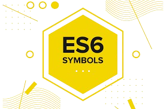

  

📦 TP Node.js ES6
=================

📖 Description
--------------

Ce projet est un travail pratique en **Node.js** visant à maîtriser les bases de **JavaScript ES6** ainsi que la programmation asynchrone.

Il inclut :

*   Manipulation des tableaux (`forEach`, `map`)
    
*   Utilisation des fonctions fléchées
    
*   Compréhension du fonctionnement asynchrone (non bloquant)
    
*   Consommation d’une API REST avec `fetch`
    

* * *

🛠️ Technologies utilisées
--------------------------

 | Technologie | Icône |
|-------------|-------|
| Node.js     |  |
| JavaScript  |  |
| ES6         |  |
| API REST    |  |
| Fetch       |  |
    

* * *

⚙️ Installation
---------------

1.  Cloner le projet :
    

    git clone https://github.com/ton-username/tp-nodejs-es6.git
    

2.  Accéder au dossier :
    

    cd tp-nodejs-es6
    

3.  Installer les dépendances :
    

    npm install
    

* * *

▶️ Exécution
------------

Lancer le projet avec la commande :

    node index.js
    

* * *

📌 Fonctionnalités
------------------

*   ✔ Affichage simple dans la console
    
*   ✔ Manipulation de tableaux avec `forEach` et `map`
    
*   ✔ Utilisation des fonctions fléchées
    
*   ✔ Simulation d’un traitement asynchrone avec `setTimeout`
    
*   ✔ Récupération de données depuis une API REST
    
*   ✔ Affichage des pays et des pays africains avec leurs capitales
    

* * *

🧠 Concepts appris
------------------

Ce projet permet de comprendre :

*   JavaScript ES6
    
*   Programmation asynchrone (`async/await`)
    
*   Fonctionnement non bloquant de Node.js
    
*   Manipulation de données JSON
    
*   Consommation d’API REST
    

* * *

🚀 Améliorations possibles
--------------------------

*   Ajouter une interface web (HTML/CSS/JS)
    
*   Transformer le projet en API avec Express.js
    
*   Connecter une base de données (MongoDB)
    
*   Ajouter des fonctionnalités de filtrage ou recherche
    

* * *

👨‍💻 Auteur
------------

**Ayoub Aguezar**

* * *

📄 Licence
----------

Ce projet est destiné à un usage pédagogique.
